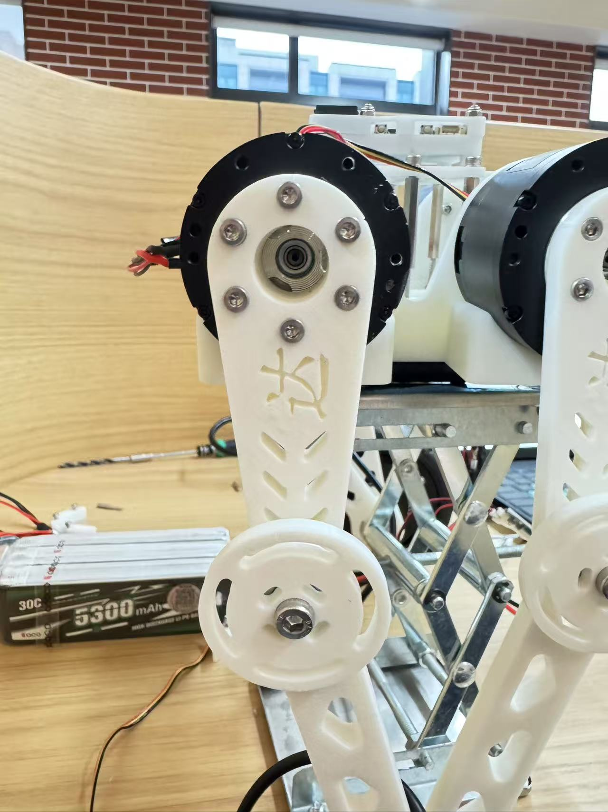
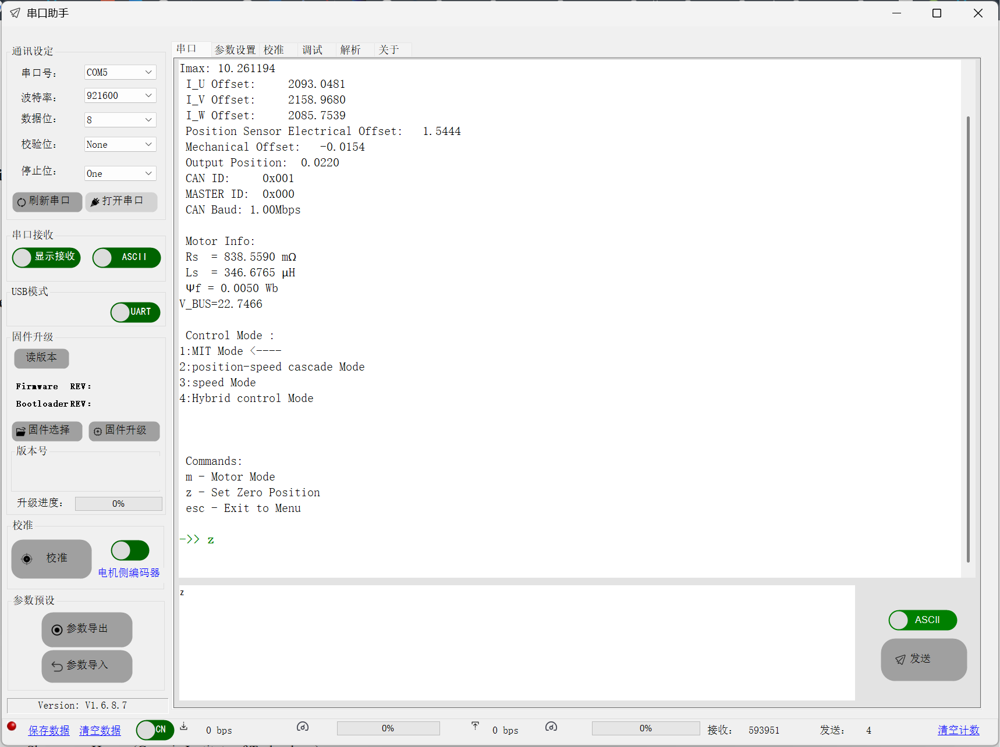
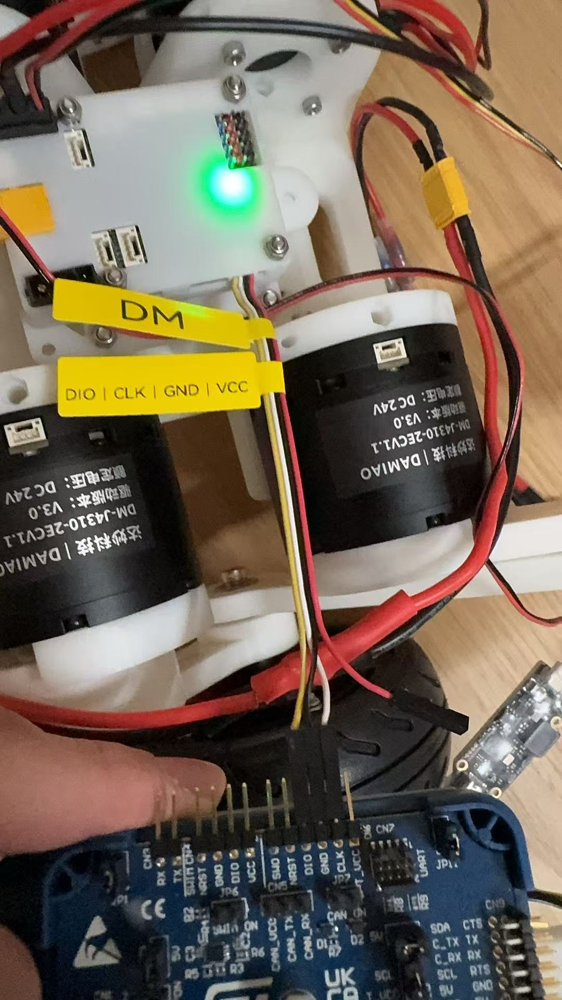
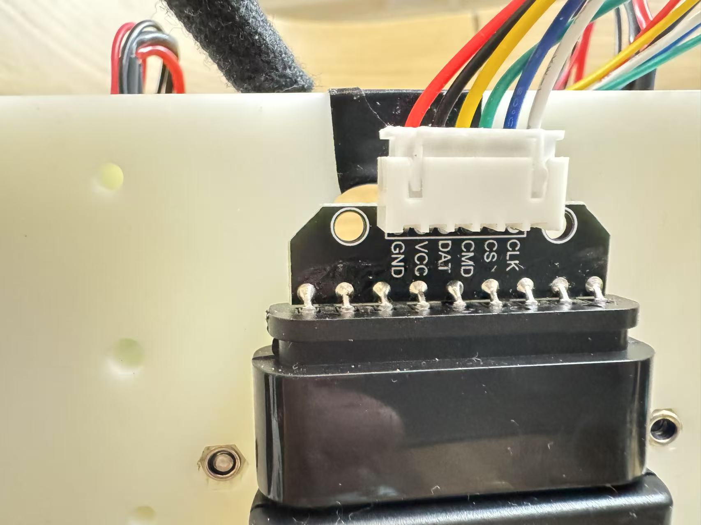
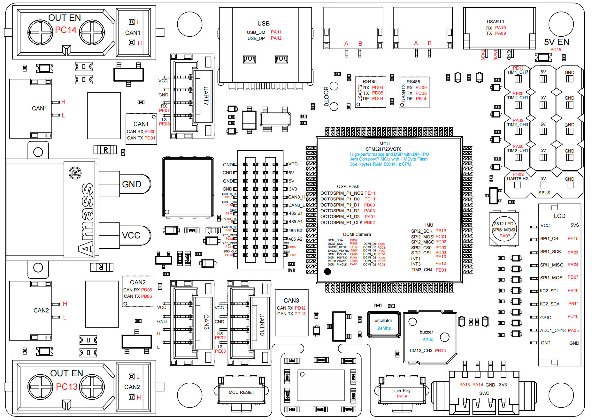
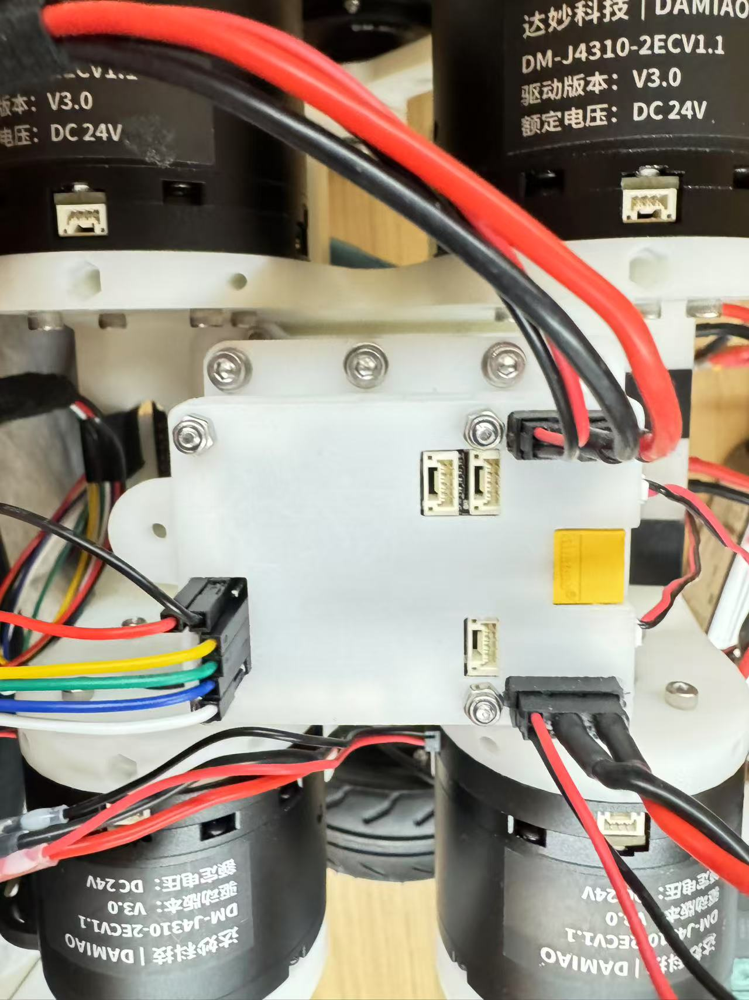
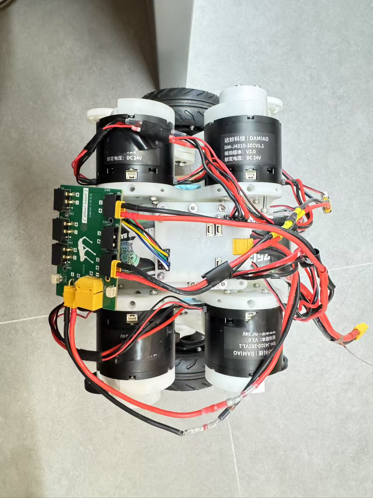
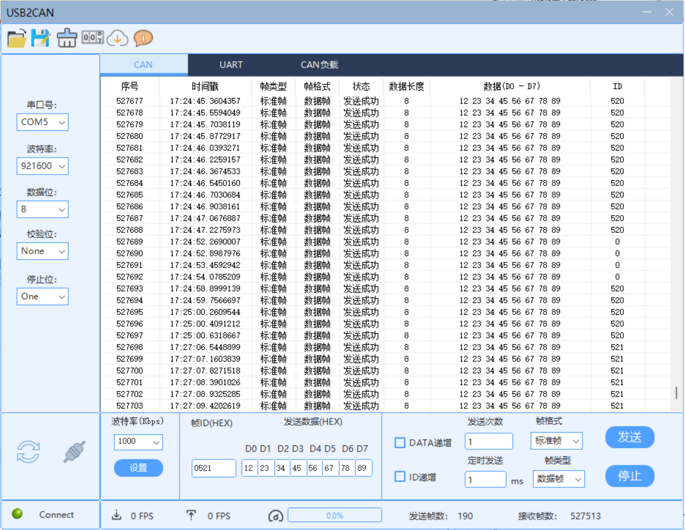
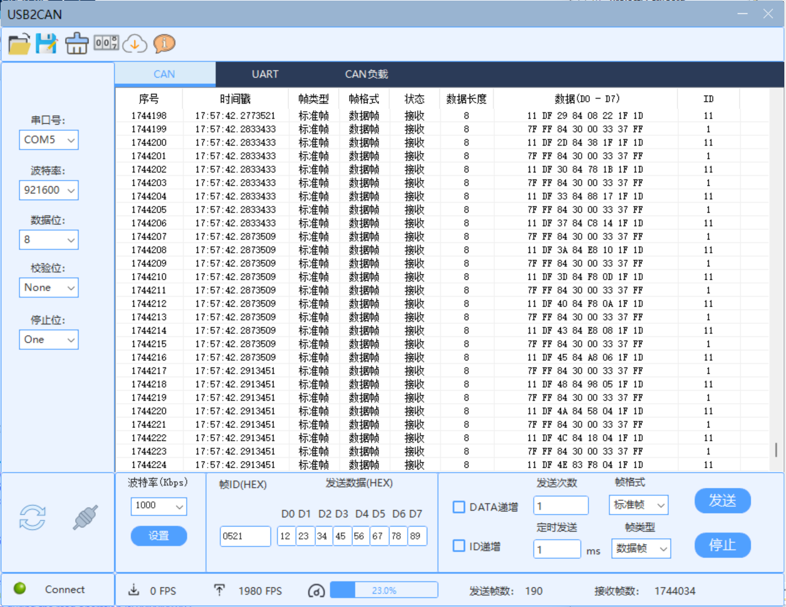

## Wheel-legged Robot

### 介绍
达妙科技开源轮足仓库，使用4个DM4310 两个DM60轮毂 一个DM-MC02开发板，结构件可以使用3D打印件。

一些文档链接：

[达妙文档](https://gl1po2nscb.feishu.cn/wiki/MZ32w0qnnizTpOkNvAZcJ9SlnXb)

[达妙总仓库](https://gitee.com/kit-miao/damiao)

[Clion开发stm32](https://zhuanlan.zhihu.com/p/145801160)

[Wheel-legged : 达妙科技开源轮足仓](https://gitee.com/kit-miao/wheel-legged)


### 理论推导
#### 整车控制 

[RoboMaster平衡步兵机器人控制系统设计](https://zhuanlan.zhihu.com/p/563048952)


### 安装教程

[轮足打印件 - 坚果云](https://www.jianguoyun.com/d/home#/sandbox/1aa45ec/68dcca12760e986a/%2F轮足打印件)

修改了下轮毂打印件的尺寸

🚧待打印部件：

| DINGBAN |  1   |
| :-----: | :--: |
| DINGGAI |  1   |


### 开发教程


#### 电机校零

打开调试助手，将电机的位置调整至下图所示的零点位置，发送z将当前状态设置为零点






#### DM-MC02烧录

1. stm32h723配置参考下述教程： [stm32h7 环境搭建](https://www.cnblogs.com/armfly/p/10671095.html)

   

2. 软件下载：

Keil MDK 5用于创建项目和编写代码，编译出HEX文件（编译器报错时，修改下options for target中的编译器即可）

STM32CubeProgrammer用于连接和烧录程序，把HEX文件烧录到STM32单片机（注意此时要么用vcc供电，要么用24V电源供电）

STM32CubeMX源码已经配置好iso文件，不用配置 [Cubemx配置](https://zhuanlan.zhihu.com/p/714301640)


3. 连线示意图

stlink与DM-MC02的连接图如下：注意有电源连接DM-MC02时，不需要连接stlink的vcc！




PS2接收器和引脚连接示意图：

CLK -> PE13

CS -> PE9

CMD -> PA2

DAT -> PA0

VCC -> SBUS 3.3V

GND -> SBUS GND








整车连接示意图：




#### DM-MC02控制4310

[电机控制文档](https://gl1po2nscb.feishu.cn/wiki/VYrlwHI7liHzXIkx0s0cUOVdnzb)

[电机控制例程 ](https://gitee.com/kit-miao/motor-control-routine/tree/master/stm32例程)

##### FDCAN接收消息



`main.c`

```c++
/* USER CODE BEGIN Header */
/**
  ******************************************************************************
  * @file           : main.c
  * @brief          : Main program body
  ******************************************************************************
  * @attention
  *
  * Copyright (c) 2024 STMicroelectronics.
  * All rights reserved.
  *
  * This software is licensed under terms that can be found in the LICENSE file
  * in the root directory of this software component.
  * If no LICENSE file comes with this software, it is provided AS-IS.
  *
  ******************************************************************************
  */
/* USER CODE END Header */
/* Includes ------------------------------------------------------------------*/
#include "main.h"
#include "fdcan.h"
#include "tim.h"
#include "usart.h"
#include "gpio.h"

/* Private includes ----------------------------------------------------------*/
/* USER CODE BEGIN Includes */
#include "bsp_fdcan.h"
#include "dm_motor_ctrl.h"
/* USER CODE END Includes */

/* Private typedef -----------------------------------------------------------*/
/* USER CODE BEGIN PTD */

/* USER CODE END PTD */

/* Private define ------------------------------------------------------------*/
/* USER CODE BEGIN PD */

/* USER CODE END PD */

/* Private macro -------------------------------------------------------------*/
/* USER CODE BEGIN PM */

/* USER CODE END PM */

/* Private variables ---------------------------------------------------------*/

/* USER CODE BEGIN PV */
uint8_t read_data[8] = {0};
uint16_t rec_id;
uint8_t len; // ??????????
/* USER CODE END PV */

/* Private function prototypes -----------------------------------------------*/
void SystemClock_Config(void);
/* USER CODE BEGIN PFP */

/* USER CODE END PFP */

/* Private user code ---------------------------------------------------------*/
/* USER CODE BEGIN 0 */
void HAL_TIM_PeriodElapsedCallback(TIM_HandleTypeDef *htim)
{
  /* USER CODE BEGIN Callback 0 */
	if (htim->Instance == TIM3) {
		
		read_all_motor_data(&motor[Motor1]);
		
		if(motor[Motor1].tmp.read_flag == 0)
			dm_motor_ctrl_send(&hfdcan1, &motor[Motor1]);
	}
}
/* USER CODE END 0 */

/**
  * @brief  The application entry point.
  * @retval int
  */
int main(void)
{
    /* MCU Configuration--------------------------------------------------------*/
    HAL_Init(); // STM32 HAL????
    SystemClock_Config(); // ??????
    MX_GPIO_Init(); // GPIO???
    MX_FDCAN1_Init(); // FDCAN1?????,???CubeMX??

    /* USER CODE BEGIN 2 */
    power(1); // ????,???????
    HAL_Delay(1000); // ??????

    // FDCAN ??
    bsp_fdcan_set_baud(&hfdcan1, CAN_CLASS, CAN_BR_1M); // ?????CAN,????1M
    // can_filter_init(); // ?? bsp_can_init() ?????????,?????????,??????
    bsp_can_init(); // ?? CAN ????????? BSP ??? CAN ???
    HAL_FDCAN_Start(&hfdcan1); // ?? FDCAN ??

    // ?? FDCAN ????
    // ?? FDCAN_IT_RX_FIFO0_WATERMARK ??? FDCAN ???????
    if (HAL_FDCAN_ActivateNotification(&hfdcan1, FDCAN_IT_RX_FIFO0_WATERMARK, 0) != HAL_OK)
    {
        Error_Handler(); // ??????,??????
    }
    /* USER CODE END 2 */

    /* Infinite loop */
    /* USER CODE BEGIN WHILE */
    while (1)
    {
        // ??????????????????,?????????????
        // ??,??????????(????????????????)
        // ??????LED??????????
    }
    /* USER CODE END WHILE */
}

/**
  * @brief System Clock Configuration
  * @retval None
  */
void SystemClock_Config(void)
{
  RCC_OscInitTypeDef RCC_OscInitStruct = {0};
  RCC_ClkInitTypeDef RCC_ClkInitStruct = {0};

  /** Supply configuration update enable
  */
  HAL_PWREx_ConfigSupply(PWR_LDO_SUPPLY);

  /** Configure the main internal regulator output voltage
  */
  __HAL_PWR_VOLTAGESCALING_CONFIG(PWR_REGULATOR_VOLTAGE_SCALE0);

  while(!__HAL_PWR_GET_FLAG(PWR_FLAG_VOSRDY)) {}

  /** Initializes the RCC Oscillators according to the specified parameters
  * in the RCC_OscInitTypeDef structure.
  */
  RCC_OscInitStruct.OscillatorType = RCC_OSCILLATORTYPE_HSE;
  RCC_OscInitStruct.HSEState = RCC_HSE_ON;
  RCC_OscInitStruct.PLL.PLLState = RCC_PLL_ON;
  RCC_OscInitStruct.PLL.PLLSource = RCC_PLLSOURCE_HSE;
  RCC_OscInitStruct.PLL.PLLM = 2;
  RCC_OscInitStruct.PLL.PLLN = 40;
  RCC_OscInitStruct.PLL.PLLP = 1;
  RCC_OscInitStruct.PLL.PLLQ = 6;
  RCC_OscInitStruct.PLL.PLLR = 2;
  RCC_OscInitStruct.PLL.PLLRGE = RCC_PLL1VCIRANGE_3;
  RCC_OscInitStruct.PLL.PLLVCOSEL = RCC_PLL1VCOWIDE;
  RCC_OscInitStruct.PLL.PLLFRACN = 0;
  if (HAL_RCC_OscConfig(&RCC_OscInitStruct) != HAL_OK)
  {
    Error_Handler();
  }

  /** Initializes the CPU, AHB and APB buses clocks
  */
  RCC_ClkInitStruct.ClockType = RCC_CLOCKTYPE_HCLK|RCC_CLOCKTYPE_SYSCLK
                              |RCC_CLOCKTYPE_PCLK1|RCC_CLOCKTYPE_PCLK2
                              |RCC_CLOCKTYPE_D3PCLK1|RCC_CLOCKTYPE_D1PCLK1;
  RCC_ClkInitStruct.SYSCLKSource = RCC_SYSCLKSOURCE_PLLCLK;
  RCC_ClkInitStruct.SYSCLKDivider = RCC_SYSCLK_DIV1;
  RCC_ClkInitStruct.AHBCLKDivider = RCC_HCLK_DIV2;
  RCC_ClkInitStruct.APB3CLKDivider = RCC_APB3_DIV2;
  RCC_ClkInitStruct.APB1CLKDivider = RCC_APB1_DIV2;
  RCC_ClkInitStruct.APB2CLKDivider = RCC_APB2_DIV2;
  RCC_ClkInitStruct.APB4CLKDivider = RCC_APB4_DIV2;

  if (HAL_RCC_ClockConfig(&RCC_ClkInitStruct, FLASH_LATENCY_3) != HAL_OK)
  {
    Error_Handler();
  }
}

/* USER CODE BEGIN 4 */

/* USER CODE END 4 */

/**
  * @brief  This function is executed in case of error occurrence.
  * @retval None
  */
void Error_Handler(void)
{
  /* USER CODE BEGIN Error_Handler_Debug */
  /* User can add his own implementation to report the HAL error return state */
  __disable_irq();
  while (1)
  {
  }
  /* USER CODE END Error_Handler_Debug */
}

#ifdef  USE_FULL_ASSERT
/**
  * @brief  Reports the name of the source file and the source line number
  *         where the assert_param error has occurred.
  * @param  file: pointer to the source file name
  * @param  line: assert_param error line source number
  * @retval None
  */
void assert_failed(uint8_t *file, uint32_t line)
{
  /* USER CODE BEGIN 6 */
  /* User can add his own implementation to report the file name and line number,
     ex: printf("Wrong parameters value: file %s on line %d\r\n", file, line) */
  /* USER CODE END 6 */
}
#endif /* USE_FULL_ASSERT */

```


##### MIT模式控制电机



`main.c`

修改HAL_TIM_PeriodElapsedCallback函数时注意放到main后面

```c++
/* USER CODE BEGIN Header */
/**
  ******************************************************************************
  * @file           : main.c
  * @brief          : Main program body
  ******************************************************************************
  * @attention
  *
  * Copyright (c) 2024 STMicroelectronics.
  * All rights reserved.
  *
  * This software is licensed under terms that can be found in the LICENSE file
  * in the root directory of this software component.
  * If no LICENSE file comes with this software, it is provided AS-IS.
  *
  ******************************************************************************
  */
/* USER CODE END Header */
/* Includes ------------------------------------------------------------------*/
#include "main.h"
#include "fdcan.h"
#include "tim.h"
#include "usart.h"
#include "gpio.h"

/* Private includes ----------------------------------------------------------*/
/* USER CODE BEGIN Includes */
#include "bsp_fdcan.h"
#include "dm_motor_ctrl.h"
/* USER CODE END Includes */

/* Private typedef -----------------------------------------------------------*/
/* USER CODE BEGIN PTD */

/* USER CODE END PTD */

/* Private define ------------------------------------------------------------*/
/* USER CODE BEGIN PD */

/* USER CODE END PD */

/* Private macro -------------------------------------------------------------*/
/* USER CODE BEGIN PM */

/* USER CODE END PM */

/* Private variables ---------------------------------------------------------*/

/* USER CODE BEGIN PV */
uint8_t read_data[8] = {0};
uint16_t rec_id;
uint8_t len; // ??????????
/* USER CODE END PV */

/* Private function prototypes -----------------------------------------------*/
void SystemClock_Config(void);
/* USER CODE BEGIN PFP */

/* USER CODE END PFP */

/* Private user code ---------------------------------------------------------*/
/* USER CODE BEGIN 0 */

/* USER CODE END 0 */

/**
  * @brief  The application entry point.
  * @retval int
  */
int main(void)
{
    /* MCU Configuration--------------------------------------------------------*/
    HAL_Init();
    SystemClock_Config();
    MX_GPIO_Init();
    MX_FDCAN1_Init();
    MX_TIM3_Init(); // ?? TIM3 ???? CubeMX ???
    MX_USART1_UART_Init();
    MX_TIM4_Init();

    /* USER CODE BEGIN 2 */
    power(1);        // ????????????
    HAL_Delay(1000); // ??????????

    bsp_fdcan_set_baud(&hfdcan1, CAN_CLASS, CAN_BR_1M);      // ??CAN????? ????1M
    bsp_can_init(); // ?? CAN ?????????
    dm_motor_init(); // ???????????
    HAL_Delay(10);

    /* **???????????MIT??** */
    // ??:??? '10' ????? MIT ?????????????
    write_motor_data(motor[Motor1].id, 10, mit_mode, 0, 0, 0);    // ?????MIT??
    HAL_Delay(100);
    save_motor_data(motor[Motor1].id, 10);        // ??????
    HAL_Delay(100);
    dm_motor_enable(&hfdcan1, &motor[Motor1]);    // ????
    HAL_Delay(1000);

    HAL_TIM_Base_Start_IT(&htim3);                // ??1ms?????????can??
    /* USER CODE END 2 */

    /* Infinite loop */
    /* USER CODE BEGIN WHILE */
    while (1)
    {
        /* USER CODE END WHILE */

        /* USER CODE BEGIN 3 */
        // ???????????????????
        // ?? CAN ????????????????,?????????
        HAL_Delay(1); // ????????CPU??
        /* USER CODE END 3 */
    }
}
/**
  * @brief System Clock Configuration
  * @retval None
  */
void SystemClock_Config(void)
{
  RCC_OscInitTypeDef RCC_OscInitStruct = {0};
  RCC_ClkInitTypeDef RCC_ClkInitStruct = {0};

  /** Supply configuration update enable
  */
  HAL_PWREx_ConfigSupply(PWR_LDO_SUPPLY);

  /** Configure the main internal regulator output voltage
  */
  __HAL_PWR_VOLTAGESCALING_CONFIG(PWR_REGULATOR_VOLTAGE_SCALE0);

  while(!__HAL_PWR_GET_FLAG(PWR_FLAG_VOSRDY)) {}

  /** Initializes the RCC Oscillators according to the specified parameters
  * in the RCC_OscInitTypeDef structure.
  */
  RCC_OscInitStruct.OscillatorType = RCC_OSCILLATORTYPE_HSE;
  RCC_OscInitStruct.HSEState = RCC_HSE_ON;
  RCC_OscInitStruct.PLL.PLLState = RCC_PLL_ON;
  RCC_OscInitStruct.PLL.PLLSource = RCC_PLLSOURCE_HSE;
  RCC_OscInitStruct.PLL.PLLM = 2;
  RCC_OscInitStruct.PLL.PLLN = 40;
  RCC_OscInitStruct.PLL.PLLP = 1;
  RCC_OscInitStruct.PLL.PLLQ = 6;
  RCC_OscInitStruct.PLL.PLLR = 2;
  RCC_OscInitStruct.PLL.PLLRGE = RCC_PLL1VCIRANGE_3;
  RCC_OscInitStruct.PLL.PLLVCOSEL = RCC_PLL1VCOWIDE;
  RCC_OscInitStruct.PLL.PLLFRACN = 0;
  if (HAL_RCC_OscConfig(&RCC_OscInitStruct) != HAL_OK)
  {
    Error_Handler();
  }

  /** Initializes the CPU, AHB and APB buses clocks
  */
  RCC_ClkInitStruct.ClockType = RCC_CLOCKTYPE_HCLK|RCC_CLOCKTYPE_SYSCLK
                              |RCC_CLOCKTYPE_PCLK1|RCC_CLOCKTYPE_PCLK2
                              |RCC_CLOCKTYPE_D3PCLK1|RCC_CLOCKTYPE_D1PCLK1;
  RCC_ClkInitStruct.SYSCLKSource = RCC_SYSCLKSOURCE_PLLCLK;
  RCC_ClkInitStruct.SYSCLKDivider = RCC_SYSCLK_DIV1;
  RCC_ClkInitStruct.AHBCLKDivider = RCC_HCLK_DIV2;
  RCC_ClkInitStruct.APB3CLKDivider = RCC_APB3_DIV2;
  RCC_ClkInitStruct.APB1CLKDivider = RCC_APB1_DIV2;
  RCC_ClkInitStruct.APB2CLKDivider = RCC_APB2_DIV2;
  RCC_ClkInitStruct.APB4CLKDivider = RCC_APB4_DIV2;

  if (HAL_RCC_ClockConfig(&RCC_ClkInitStruct, FLASH_LATENCY_3) != HAL_OK)
  {
    Error_Handler();
  }
}

/* USER CODE BEGIN 4 */
void HAL_TIM_PeriodElapsedCallback(TIM_HandleTypeDef *htim)
{
    if (htim->Instance == TIM3) {
        // ??????????????????
        dm_motor_ctrl_send(&hfdcan1, &motor[Motor1]);
    }
}
/* USER CODE END 4 */

/**
  * @brief  This function is executed in case of error occurrence.
  * @retval None
  */
void Error_Handler(void)
{
  /* USER CODE BEGIN Error_Handler_Debug */
  /* User can add his own implementation to report the HAL error return state */
  __disable_irq();
  while (1)
  {
  }
  /* USER CODE END Error_Handler_Debug */
}

#ifdef  USE_FULL_ASSERT
/**
  * @brief  Reports the name of the source file and the source line number
  *         where the assert_param error has occurred.
  * @param  file: pointer to the source file name
  * @param  line: assert_param error line source number
  * @retval None
  */
void assert_failed(uint8_t *file, uint32_t line)
{
  /* USER CODE BEGIN 6 */
  /* User can add his own implementation to report the file name and line number,
     ex: printf("Wrong parameters value: file %s on line %d\r\n", file, line) */
  /* USER CODE END 6 */
}
#endif /* USE_FULL_ASSERT */

```

`dm_ctrl.c`

```C++
#include "dm_motor_drv.h"
#include "dm_motor_ctrl.h"
#include "string.h"
#include "stdbool.h"

motor_t motor[num];


/**
************************************************************************
* @brief:      	dm4310_motor_init: DM4310µç»ú³õʼ»¯º¯Êý
* @param:      	void
* @retval:     	void
* @details:    	³õʼ»¯1¸öDM4310Ðͺŵĵç»ú£¬ÉèÖÃĬÈϲÎÊýºÍ¿ØÖÆģʽ¡£
*               ÉèÖÃID¡¢¿ØÖÆģʽºÍÃüÁîģʽµÈÐÅÏ¢¡£
************************************************************************
**/
void dm_motor_init(void)
{
	// ³õʼ»¯Motor1ºÍMotor2µÄµç»ú½á¹¹
	memset(&motor[Motor1], 0, sizeof(motor[Motor1]));

	// ÉèÖÃMotor1µÄµç»úÐÅÏ¢
	motor[Motor1].id = 0x01;
	motor[Motor1].mst_id = 0x00;	// ʵ¼ÊûÓÐÓÃÉÏ£¬Ö»×ö±êʶ×÷ÓÃ
	motor[Motor1].tmp.read_flag = 1;
	motor[Motor1].ctrl.mode 	= mit_mode;
	motor[Motor1].ctrl.vel_set 	= 1.0f;
	motor[Motor1].ctrl.pos_set 	= 0.0f;
	motor[Motor1].ctrl.tor_set 	= 0.0f;
	motor[Motor1].ctrl.cur_set 	= 0.0f;
	motor[Motor1].ctrl.kp_set 	= 0.0f;
	motor[Motor1].ctrl.kd_set 	= 1.0f;
	motor[Motor1].tmp.PMAX		= 12.5f;
	motor[Motor1].tmp.VMAX		= 30.0f;
	motor[Motor1].tmp.TMAX		= 10.0f;
}
/**
************************************************************************
* @brief:      	read_all_motor_data: ¶ÁÈ¡µç»úµÄËùÓмĴæÆ÷µÄÊý¾ÝÐÅÏ¢
* @param:      	motor_t£ºµç»ú²ÎÊý½á¹¹Ìå
* @retval:     	void
* @details:    	Öð´Î·¢ËͶÁÈ¡ÃüÁî
************************************************************************
**/
void read_all_motor_data(motor_t *motor)
{
    switch (motor->tmp.read_flag)
    {
		case 1:  read_motor_data(motor->id, RID_UV_VALUE);  break; // UV_Value
		case 2:  read_motor_data(motor->id, RID_KT_VALUE);  break; // KT_Value
		case 3:  read_motor_data(motor->id, RID_OT_VALUE);  break; // OT_Value
		case 4:  read_motor_data(motor->id, RID_OC_VALUE);  break; // OC_Value
		case 5:  read_motor_data(motor->id, RID_ACC);       break; // ACC
		case 6:  read_motor_data(motor->id, RID_DEC);       break; // DEC
		case 7:  read_motor_data(motor->id, RID_MAX_SPD);   break; // MAX_SPD
		case 8:  read_motor_data(motor->id, RID_MST_ID);    break; // MST_ID 
		case 9:  read_motor_data(motor->id, RID_ESC_ID);    break; // ESC_ID
		case 10: read_motor_data(motor->id, RID_TIMEOUT);   break; // TIMEOUT 
		case 11: read_motor_data(motor->id, RID_CMODE);     break; // CTRL_MODE 
		case 12: read_motor_data(motor->id, RID_DAMP);      break; // Damp 
		case 13: read_motor_data(motor->id, RID_INERTIA);   break; // Inertia
		case 14: read_motor_data(motor->id, RID_HW_VER);    break; // Rsv1 
		case 15: read_motor_data(motor->id, RID_SW_VER);    break; // sw_ver 
		case 16: read_motor_data(motor->id, RID_SN);        break; // Rsv2 
		case 17: read_motor_data(motor->id, RID_NPP);       break; // NPP 
		case 18: read_motor_data(motor->id, RID_RS);        break; // Rs 
		case 19: read_motor_data(motor->id, RID_LS);        break; // Ls 
		case 20: read_motor_data(motor->id, RID_FLUX);      break; // Flux 
		case 21: read_motor_data(motor->id, RID_GR);        break; // Gr 
		case 22: read_motor_data(motor->id, RID_PMAX);      break; // PMAX 
		case 23: read_motor_data(motor->id, RID_VMAX);      break; // VMAX 
		case 24: read_motor_data(motor->id, RID_TMAX);      break; // TMAX 
		case 25: read_motor_data(motor->id, RID_I_BW);      break; // I_BW 
		case 26: read_motor_data(motor->id, RID_KP_ASR);    break; // KP_ASR 
		case 27: read_motor_data(motor->id, RID_KI_ASR);    break; // KI_ASR 
		case 28: read_motor_data(motor->id, RID_KP_APR);    break; // KP_APR 
		case 29: read_motor_data(motor->id, RID_KI_APR);    break; // KI_APR 
		case 30: read_motor_data(motor->id, RID_OV_VALUE);  break; // OV_Value 
		case 31: read_motor_data(motor->id, RID_GREF);      break; // GREF 
		case 32: read_motor_data(motor->id, RID_DETA);      break; // Deta 
		case 33: read_motor_data(motor->id, RID_V_BW);      break; // V_BW 
		case 34: read_motor_data(motor->id, RID_IQ_CL);     break; // IQ_c1 
		case 35: read_motor_data(motor->id, RID_VL_CL);     break; // VL_c1 
		case 36: read_motor_data(motor->id, RID_CAN_BR);    break; // can_br 
		case 37: read_motor_data(motor->id, RID_SUB_VER);   break; // sub_ver 
		case 38: read_motor_data(motor->id, RID_U_OFF);     break; // u_off 
		case 39: read_motor_data(motor->id, RID_V_OFF);     break; // v_off 
		case 40: read_motor_data(motor->id, RID_K1);        break; // k1 
		case 41: read_motor_data(motor->id, RID_K2);        break; // k2 
		case 42: read_motor_data(motor->id, RID_M_OFF);     break; // m_off 
		case 43: read_motor_data(motor->id, RID_DIR);       break; // dir 
		case 44: read_motor_data(motor->id, RID_P_M);       break; // pm 
		case 45: read_motor_data(motor->id, RID_X_OUT);     break; // xout 
    }
}
/**
************************************************************************
* @brief:      	receive_motor_data: ½ÓÊÕµç»ú·µ»ØµÄÊý¾ÝÐÅÏ¢
* @param:      	motor_t£ºµç»ú²ÎÊý½á¹¹Ìå
* @param:      	data£º½ÓÊÕµÄÊý¾Ý
* @retval:     	void
* @details:    	Öð´Î½ÓÊÕµç»ú»Ø´«µÄ²ÎÊýÐÅÏ¢
************************************************************************
**/
void receive_motor_data(motor_t *motor, uint8_t *data)
{
	if(motor->tmp.read_flag == 0)
		return ;
	
	float_type_u y;
	
	if(data[2] == 0x33)
	{
		uint16_t rid_value = data[3];
		y.b_val[0] = data[4];
		y.b_val[1] = data[5];
		y.b_val[2] = data[6];
		y.b_val[3] = data[7];
		
		switch (rid_value) 
		{
			case RID_UV_VALUE: motor->tmp.UV_Value = y.f_val; motor->tmp.read_flag =  2; break;
			case RID_KT_VALUE: motor->tmp.KT_Value = y.f_val; motor->tmp.read_flag =  3; break;
			case RID_OT_VALUE: motor->tmp.OT_Value = y.f_val; motor->tmp.read_flag =  4; break;
			case RID_OC_VALUE: motor->tmp.OC_Value = y.f_val; motor->tmp.read_flag =  5; break;
			case RID_ACC:      motor->tmp.ACC      = y.f_val; motor->tmp.read_flag =  6; break;
			case RID_DEC:      motor->tmp.DEC      = y.f_val; motor->tmp.read_flag =  7; break;
			case RID_MAX_SPD:  motor->tmp.MAX_SPD  = y.f_val; motor->tmp.read_flag =  8; break;
			case RID_MST_ID:   motor->tmp.MST_ID   = y.u_val; motor->tmp.read_flag =  9; break;
			case RID_ESC_ID:   motor->tmp.ESC_ID   = y.u_val; motor->tmp.read_flag = 10; break;
			case RID_TIMEOUT:  motor->tmp.TIMEOUT  = y.u_val; motor->tmp.read_flag = 11; break;
			case RID_CMODE:    motor->tmp.cmode    = y.u_val; motor->tmp.read_flag = 12; break;
			case RID_DAMP:     motor->tmp.Damp     = y.f_val; motor->tmp.read_flag = 13; break;
			case RID_INERTIA:  motor->tmp.Inertia  = y.f_val; motor->tmp.read_flag = 14; break;
			case RID_HW_VER:   motor->tmp.hw_ver   = y.u_val; motor->tmp.read_flag = 15; break;
			case RID_SW_VER:   motor->tmp.sw_ver   = y.u_val; motor->tmp.read_flag = 16; break;
			case RID_SN:       motor->tmp.SN       = y.u_val; motor->tmp.read_flag = 17; break;
			case RID_NPP:      motor->tmp.NPP      = y.u_val; motor->tmp.read_flag = 18; break;
			case RID_RS:       motor->tmp.Rs       = y.f_val; motor->tmp.read_flag = 19; break;
			case RID_LS:       motor->tmp.Ls       = y.f_val; motor->tmp.read_flag = 20; break;
			case RID_FLUX:     motor->tmp.Flux     = y.f_val; motor->tmp.read_flag = 21; break;
			case RID_GR:       motor->tmp.Gr       = y.f_val; motor->tmp.read_flag = 22; break;
			case RID_PMAX:     motor->tmp.PMAX     = y.f_val; motor->tmp.read_flag = 23; break;
			case RID_VMAX:     motor->tmp.VMAX     = y.f_val; motor->tmp.read_flag = 24; break;
			case RID_TMAX:     motor->tmp.TMAX     = y.f_val; motor->tmp.read_flag = 25; break;
			case RID_I_BW:     motor->tmp.I_BW     = y.f_val; motor->tmp.read_flag = 26; break;
			case RID_KP_ASR:   motor->tmp.KP_ASR   = y.f_val; motor->tmp.read_flag = 27; break;
			case RID_KI_ASR:   motor->tmp.KI_ASR   = y.f_val; motor->tmp.read_flag = 28; break;
			case RID_KP_APR:   motor->tmp.KP_APR   = y.f_val; motor->tmp.read_flag = 29; break;
			case RID_KI_APR:   motor->tmp.KI_APR   = y.f_val; motor->tmp.read_flag = 30; break;
			case RID_OV_VALUE: motor->tmp.OV_Value = y.f_val; motor->tmp.read_flag = 31; break;
			case RID_GREF:     motor->tmp.GREF     = y.f_val; motor->tmp.read_flag = 32; break;
			case RID_DETA:     motor->tmp.Deta     = y.f_val; motor->tmp.read_flag = 33; break;
			case RID_V_BW:     motor->tmp.V_BW     = y.f_val; motor->tmp.read_flag = 34; break;
			case RID_IQ_CL:    motor->tmp.IQ_cl    = y.f_val; motor->tmp.read_flag = 35; break;
			case RID_VL_CL:    motor->tmp.VL_cl    = y.f_val; motor->tmp.read_flag = 36; break;
			case RID_CAN_BR:   motor->tmp.can_br   = y.u_val; motor->tmp.read_flag = 37; break;
			case RID_SUB_VER:  motor->tmp.sub_ver  = y.u_val; motor->tmp.read_flag = 38; break;
			case RID_U_OFF:    motor->tmp.u_off    = y.f_val; motor->tmp.read_flag = 39; break;
			case RID_V_OFF:    motor->tmp.v_off    = y.f_val; motor->tmp.read_flag = 40; break;
			case RID_K1:       motor->tmp.k1       = y.f_val; motor->tmp.read_flag = 41; break;
			case RID_K2:       motor->tmp.k2       = y.f_val; motor->tmp.read_flag = 42; break;
			case RID_M_OFF:    motor->tmp.m_off    = y.f_val; motor->tmp.read_flag = 43; break;
			case RID_DIR:      motor->tmp.dir      = y.f_val; motor->tmp.read_flag = 44; break;
			case RID_P_M:      motor->tmp.p_m      = y.f_val; motor->tmp.read_flag = 45; break;
			case RID_X_OUT:    motor->tmp.x_out    = y.f_val; motor->tmp.read_flag = 0 ; break;
		}
	}
}

/**
************************************************************************
* @brief:      	fdcan1_rx_callback: CAN1½ÓÊջص÷º¯Êý
* @param:      	void
* @retval:     	void
* @details:    	´¦ÀíCAN1½ÓÊÕÖжϻص÷£¬¸ù¾Ý½ÓÊÕµ½µÄIDºÍÊý¾Ý£¬Ö´ÐÐÏàÓ¦µÄ´¦Àí¡£
*               µ±½ÓÊÕµ½IDΪ0ʱ£¬µ÷ÓÃdm4310_fbdataº¯Êý¸üÐÂMotorµÄ·´À¡Êý¾Ý¡£
************************************************************************
**/
void fdcan1_rx_callback(void)
{
	uint16_t rec_id;
	uint8_t rx_data[8] = {0};
	fdcanx_receive(&hfdcan1, &rec_id, rx_data);
	switch (rec_id)
	{
 		case 0x00: dm_motor_fbdata(&motor[Motor1], rx_data); receive_motor_data(&motor[Motor1], rx_data); break;
	}
}


```


#### 手柄控制


1. 启动/停止：

按下start以启动(⚠️注意：由于锂电池过重，启动时需要人手扶)

2. 运动控制：

向上推动左侧的摇杆，启动轮足，可以进入静止平衡状态。

向上推动右侧摇杆，轮足前进；向下推动左侧摇杆，轮足后退。

向左推动右侧摇杆，轮足逆时针旋转；向右推动右侧摇杆，轮足顺时针旋转。

3. 姿态控制：

🚧打印件版腿暂时无法实现，机加工版程序可以实现

4. 其他：

按下手柄的SELECT键可以将roll角度归零


